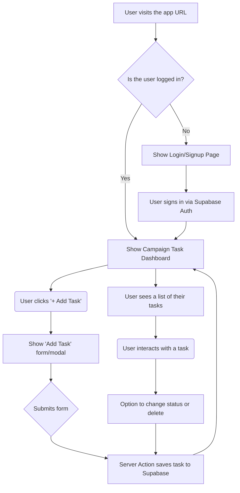

# 🚀 CampaignFlow - Influencer Campaign Manager

A beautiful, modern task management application designed for managing influencer marketing campaigns with an elegant, first-class UI featuring glass morphism and smooth animations.


---

## ✨ Features

### 🎨 Premium Design
- **Glass Morphism UI** - Modern frosted glass effects with backdrop blur
- **Gradient Accents** - Beautiful purple/pink gradient theme throughout
- **Smooth Animations** - Fade-in, slide-up, scale, and lift effects
- **Enhanced Shadows** - Multi-layered shadows with purple tints
- **Custom Scrollbar** - Styled to match the premium theme

### 📋 Task Management
- **Kanban Board** - 4-column workflow (Backlog → In Progress → Awaiting Approval → Done)
- **Drag & Drop** - Smooth, accessible task movement between columns
- **Real-time Filters** - Filter by priority, platform, and assignee
- **Search** - Instant task and influencer search
- **Keyboard Shortcuts** - `n` for new task, `⌘K` or `/` for search

### 👥 Influencer Management
- **Multi-Platform Support** - Instagram, TikTok, YouTube
- **Influencer Profiles** - Avatar, handle, platform badges
- **Task Assignment** - Multiple assignees per task
- **Deliverable Types** - Post, Story, Reel, Short

### 🔐 Authentication
- **Supabase Integration** - Secure authentication (optional)
- **Email Verification** - Confirmation flow with resend capability
- **Google OAuth** - Social login support (configurable)
- **Mock Mode** - Cookie-based auth for development

---

## 🔄 User Flow

The application follows a simple, intuitive workflow:



### Key Workflows

1. **Authentication Flow**
   - Unauthenticated users are redirected to login
   - Support for email/password and Google OAuth
   - Email verification required (Supabase mode)
   - Session persists across browser refreshes

2. **Task Management Flow**
   - View all tasks in Kanban columns
   - Drag tasks between columns to update status
   - Click "Add Task" to create new campaigns
   - Edit tasks via click or hover actions
   - Delete with confirmation dialog

3. **Filtering & Search Flow**
   - Apply filters by priority, platform, or assignee
   - Search tasks in real-time
   - Clear all filters with one click
   - Use keyboard shortcuts for speed

---

## 🛠️ Tech Stack

### Core
- **[Next.js 16](https://nextjs.org/)** - React framework with App Router & Turbopack
- **[TypeScript](https://www.typescriptlang.org/)** - Type-safe development
- **[Tailwind CSS 4](https://tailwindcss.com/)** - Utility-first CSS framework
- **[React 19](https://react.dev/)** - Latest React with Server Components

### UI & Interactions
- **[shadcn/ui](https://ui.shadcn.com/)** - 60+ accessible component primitives
- **[Lucide React](https://lucide.dev/)** - Beautiful icon library
- **[@hello-pangea/dnd](https://github.com/hello-pangea/dnd)** - Accessible drag-and-drop
- **[React Hook Form](https://react-hook-form.com/)** - Performant form management
- **[Zod](https://zod.dev/)** - Schema validation

### Backend (Optional)
- **[Supabase](https://supabase.com/)** - Authentication & Database
- **Mock Data Client** - In-memory CRUD for development

### Utilities
- **[date-fns](https://date-fns.org/)** - Date formatting
- **[clsx](https://github.com/lukeed/clsx)** - Conditional classNames
- **[tailwind-merge](https://github.com/dcastil/tailwind-merge)** - Merge Tailwind classes

---

## 🚀 Getting Started

### Prerequisites

- **Node.js** 18.x or higher
- **npm** or **pnpm** package manager
- **(Optional)** Supabase account for authentication

### Installation

1. **Clone the repository**
   ```bash
   git clone https://github.com/yourusername/campaignflow.git
   cd campaignflow
   ```

2. **Install dependencies**
   ```bash
   npm install
   # or
   pnpm install
   ```

3. **Set up environment variables**

   Create a `.env.local` file in the root directory:

   ```env
   # Data Backend (mock or supabase)
   NEXT_PUBLIC_DATA_BACKEND=mock

   # Supabase Configuration (optional - only if using NEXT_PUBLIC_DATA_BACKEND=supabase)
   NEXT_PUBLIC_SUPABASE_URL=your_supabase_url
   NEXT_PUBLIC_SUPABASE_ANON_KEY=your_supabase_anon_key

   # Google OAuth (optional)
   NEXT_PUBLIC_GOOGLE_OAUTH_ENABLED=false
   ```

4. **Run the development server**
   ```bash
   npm run dev
   # or
   pnpm dev
   ```

5. **Open your browser**

   Navigate to [http://localhost:3000](http://localhost:3000)

---

## 📁 Project Structure

```
influencer-task-manager/
├── app/                          # Next.js App Router
│   ├── (auth)/                   # Authentication pages
│   │   ├── login/
│   │   ├── signup/
│   │   └── verify-email/
│   ├── dashboard/                # Main dashboard
│   ├── layout.tsx                # Root layout
│   └── globals.css               # Global styles + design system
├── components/                   # React components
│   ├── ui/                       # shadcn/ui primitives
│   ├── AppHeader.tsx             # Navigation header
│   ├── Board.tsx                 # Kanban board container
│   ├── Column.tsx                # Board column
│   ├── TaskCard.tsx              # Individual task card
│   ├── FiltersBar.tsx            # Filter controls
│   ├── AddTaskModal.tsx          # Task creation modal
│   ├── EditTaskDrawer.tsx        # Task editing drawer
│   ├── DeleteConfirmDialog.tsx   # Delete confirmation
│   ├── EmptyState.tsx            # Empty state component
│   └── ToastProvider.tsx         # Toast notifications
├── lib/                          # Utilities & data
│   ├── dataClient.ts             # Data access layer
│   ├── sampleData.ts             # Mock data
│   ├── supabase/                 # Supabase client
│   └── utils.tsx                 # Helper functions
├── types/                        # TypeScript types
│   └── index.ts
└── deliverables/                 # Project documentation
    ├── OUTLINE.md
    └── PROGRESS.md
```

---

## 🎯 Usage

### Mock Mode (Default)
Perfect for development and testing without setting up a database:
- Uses in-memory data storage
- Cookie-based authentication
- Simulated API latency
- Pre-loaded sample data

### Supabase Mode
For production deployment with real authentication:

1. **Create a Supabase project** at [supabase.com](https://supabase.com)

2. **Set up authentication**
   - Enable Email/Password authentication
   - (Optional) Enable Google OAuth provider

3. **Create database tables**
   ```sql
   -- Tasks table
   create table tasks (
     id uuid default uuid_generate_v4() primary key,
     user_id uuid references auth.users not null,
     title text not null,
     influencer jsonb not null,
     priority text not null,
     status text not null,
     due_date text,
     budget integer,
     deliverable text,
     assignees jsonb,
     notes text,
     created_at timestamp with time zone default timezone('utc'::text, now()) not null
   );

   -- Enable Row Level Security
   alter table tasks enable row level security;

   -- Policy: Users can only access their own tasks
   create policy "Users can access own tasks"
     on tasks for all
     using (auth.uid() = user_id);
   ```

4. **Update environment variables**
   ```env
   NEXT_PUBLIC_DATA_BACKEND=supabase
   NEXT_PUBLIC_SUPABASE_URL=your_project_url
   NEXT_PUBLIC_SUPABASE_ANON_KEY=your_anon_key
   ```

---

## ⌨️ Keyboard Shortcuts

| Shortcut | Action |
|----------|--------|
| `n` | Open "Add Task" modal |
| `⌘K` or `/` | Focus search bar |
| `Esc` | Close modals/dialogs |

---

## 🎨 Design System

### Color Palette
- **Background**: Deep navy gradient (#0a0b14)
- **Accent**: Purple to pink gradient (#8b5cf6 → #ec4899)
- **Glass**: Semi-transparent with backdrop blur
- **Text**: Light foreground (#e8eaf0) with muted variants

### Animations
- **Fade In**: Smooth entrance for modals
- **Slide Up**: Bottom-to-top for content
- **Scale In**: Pop-in effect for dialogs
- **Hover Lift**: Subtle elevation on hover

### Components
All components feature:
- Glass morphism with backdrop blur
- Gradient accents and borders
- Smooth transitions (300ms cubic-bezier)
- Enhanced shadows with purple tints
- Responsive design (mobile-first)

---

## 🏗️ Building for Production

```bash
# Build the application
npm run build

# Start production server
npm start
```

The build process:
- ✅ Compiles TypeScript
- ✅ Optimizes CSS with Tailwind
- ✅ Bundles JavaScript with Turbopack
- ✅ Generates static pages where possible
- ✅ Validates Next.js 16 requirements

---

## 🚢 Deployment

### Vercel (Recommended)

1. **Connect your repository** to Vercel
2. **Set environment variables** in project settings
3. **Deploy** - automatic deployments on push

### Other Platforms

Compatible with any platform supporting Next.js:
- Netlify
- Railway
- AWS Amplify
- Self-hosted with Docker

**Environment Variables Required:**
- `NEXT_PUBLIC_DATA_BACKEND`
- `NEXT_PUBLIC_SUPABASE_URL` (if using Supabase)
- `NEXT_PUBLIC_SUPABASE_ANON_KEY` (if using Supabase)

---

## 🤝 Contributing

Contributions are welcome! Please feel free to submit a Pull Request.

1. Fork the repository
2. Create your feature branch (`git checkout -b feature/AmazingFeature`)
3. Commit your changes (`git commit -m 'Add some AmazingFeature'`)
4. Push to the branch (`git push origin feature/AmazingFeature`)
5. Open a Pull Request

---

## 📝 License

This project is licensed under the MIT License - see the [LICENSE](LICENSE) file for details.

---

## 🙏 Acknowledgments

- **Design Inspiration**: Modern SaaS applications with premium UI
- **Component Library**: [shadcn/ui](https://ui.shadcn.com/)
- **Icons**: [Lucide](https://lucide.dev/)
- **Authentication**: [Supabase](https://supabase.com/)

---

## 📞 Support

For support, questions, or feedback:
- 📧 Email: your.email@example.com
- 🐛 Issues: [GitHub Issues](https://github.com/yourusername/campaignflow/issues)
- 💬 Discussions: [GitHub Discussions](https://github.com/yourusername/campaignflow/discussions)

---

<div align="center">
  <p>Built with ❤️ using Next.js, TypeScript, and Tailwind CSS</p>
  <p>⭐ Star this repo if you found it helpful!</p>
</div>
